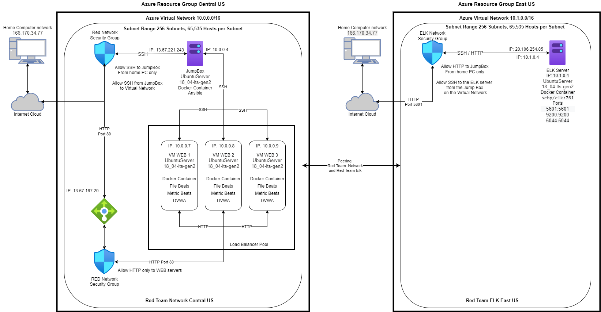
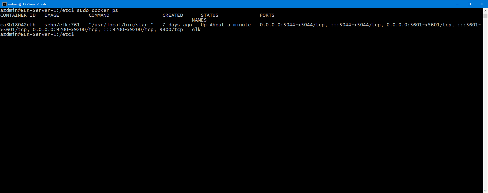

## Automated ELK Stack Deployment

The files in this repository were used to configure the network depicted below.

These files have been tested and used to generate a live ELK deployment on Azure. They can be used to either recreate the entire deployment pictured above. Alternatively, select portions of the playbook files may be used to install only certain pieces of it, such as Filebeat.

  

This document contains the following details:
- Description of the Topology
- Access Policies
- ELK Configuration
  - Beats in Use
  - Machines Being Monitored
- How to Use the Ansible Build

### Description of the Topology

The main purpose of this network is to expose a load-balanced and monitored instance of DVWA, the D*mn Vulnerable Web Application.

Load balancing ensures that the application will be highly redundant, in addition to restricting access to the network.
Load balances provide redundancy in case of a failure on the WEB server. In addition, load balancers help even out the traffic load during high usage to prevent users from having a bad browsing experience, for example long load times.

Integrating an ELK server allows users to easily monitor the vulnerable VMs for changes to the logs and system operating system and services.

Filebeat is used to monitor log files or locations you desire to monitor. Filebeat then centralizes that data for Elasticsearch to index for use.
Metricbeat is used to collect operations system statistics and metric information on services. Metricbeat then sends the output to Elasticsearch for monitoring

The configuration details of each machine may be found below.
_Note: Use the [Markdown Table Generator](http://www.tablesgenerator.com/markdown_tables) to add/remove values from the table_.

| Name     | Function | IP Address | Operating System |
|----------|----------|------------|------------------|
| Jump Box |Gateway   | 10.0.0.4   | Linux            |
| WEB1     |WEB Server| 10.0.0.7   | Linux            |
| WEB2     |WEB Server| 10.0.0.8   | Linux            |
| WEB3     |WEB Server| 10.0.0.9   | Linux            |

### Access Policies

The machines on the internal network are not exposed to the public Internet. 

Only the Jumpbox machine can accept connections from the Internet. Access to this machine is only allowed from the following IP addresses:
Home Computer 166.170.34.77

Machines within the network can only be accessed by the jumpbox.
Only the home PC at 160.170.34.77 can access the Elk Server, 

A summary of the access policies in place can be found in the table below.

| Name     | Publicly Accessible | Allowed IP Addresses |
|----------|---------------------|----------------------|
| Jump Box | Yes                 |  166.170.34.77       |
| WEB1     | Yes                 |  166.170.34.77       |
| Web2     | Yes                 |  166.170.34.77       |
| Web3     | Yes                 |  166.170.34.77       |

### Elk Configuration

Ansible was used to automate configuration of the ELK machine. No configuration was performed manually, which is advantageous because
every deployment is the same. One change can be rolled out too many servers quickly

The playbook implements the following tasks:
install Docker.io
Get pip3
Install pip3
Set memory size
launch the ELK container
enable docker on boot

The following screenshot displays the result of running `docker ps` after successfully configuring the ELK instance.

### Target Machines & Beats
This ELK server is configured to monitor the following machines:
10.0.0.7, 10.0.0.8, and 10.0.0.9

We have installed the following Beats on these machines:

filebeat 7.6.1-amd64.deb

metricbeat-7.4.0-amd64.deb

These Beats allow us to collect the following information from each machine:

filebeat allows the collection of all WEB traffic data such as users, response time, OS, country locations, browser version and more.

metricbeat allows collection of logs which include SSH logons and user access as well as data on each WEB server.

### Using the Playbook
In order to use the playbook, you will need to have an Ansible control node already configured. Assuming you have such a control node provisioned: 

To make ansible run you need to update the ansible.cfg and hosts file with the ip of the VM you are on and staart ansible.

SSH into the control node and follow the steps below:
- Copy the filebeat-playbook.yml and metricbeat-playbook.yml and config files to /etc/ansible/ folder.
- Update the hosts file to include the IP's of the machines to apply the playbook to. Use the filebeat and metricbeat config file to indicate where too install.
- Run the playbook, and navigate to http://elk_server_IP:5601/app/kibana#/home to check that the installation worked as expected.

List of commands:
on the jumpbox
  sudo apt install docker.io
  sudo systemctl status docker
  if not running do this sudo systemctl start docker
  sudo docker pull cybersecurity/ansible
  sudo docker run -ti cyberxsecurity/ansible:latest bash
  ssh-keygen (create a public key)
  cat /root/.ssh/id_rsa.pub (to get the key)
  copy the key
  change the logon to this key on all WEB and ELK servers
  nano ansible.cfg (edit remote user logon)
  nano hosts (be sure to add 'ansible_python_interpreter=/usr/bin/python3' on each IP)
  
 Playbooks
   make sure all playbook, config, and hosts files are located in /etc/ansible
   docker
  ansable-playbook DVWA-playbook.yml (install WEB servers)
  ansibal-playbook filebeat.yml (installs Filebeat)
  ansibale metricbook.yml (installs metricbook)
  
Testing
   from the jump box ssh to each web server,
       docker ps on each one
   use a web browser to check that filebeat and metricbeat are runing. 
  
  
  
